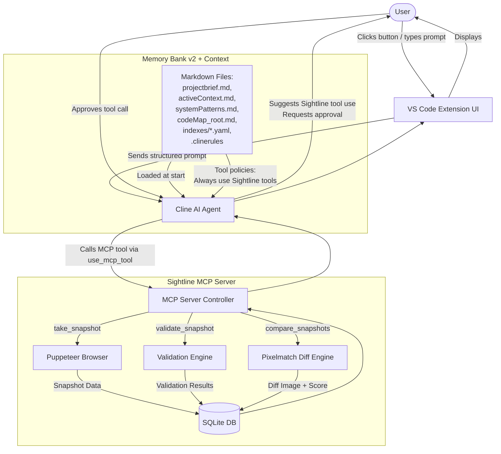

# CodeMap Root: Sightline
timestamp: 2025-04-09T10:40:42-05:00

---

## ACTIVE_MEMORY
- Components: [#VSCodeExt, #ClineAgent, #MCPServer, #MemoryBank]
- Decisions: []
- Patterns: [@MCPToolPattern, @ExplicitApproval, @MemoryBankIntegration]
- Tasks: []

---

## PROJECT_STRUCTURE
sightline/
├── .clinerules
├── README.md
├── LICENSE
├── memory_docs/
│   ├── projectbrief.md
│   ├── activeContext.md
│   ├── systemPatterns.md
│   ├── techContext.md
│   ├── progress.md
│   ├── codeMap_root.md
│   └── indexes/
│       ├── components_index.yaml
│       ├── services_index.yaml
│       ├── utils_index.yaml
│       └── models_index.yaml
└── src/
    └── (MCP server, extension code to be added)

---

## FLOW_DIAGRAMS

### Sightline Architecture

---

## INDEXES
- `memory_docs/indexes/components_index.yaml`
- `memory_docs/indexes/services_index.yaml`
- `memory_docs/indexes/utils_index.yaml`
- `memory_docs/indexes/models_index.yaml`

---

## Notes
Update this file as new components, flows, and decisions are added.
