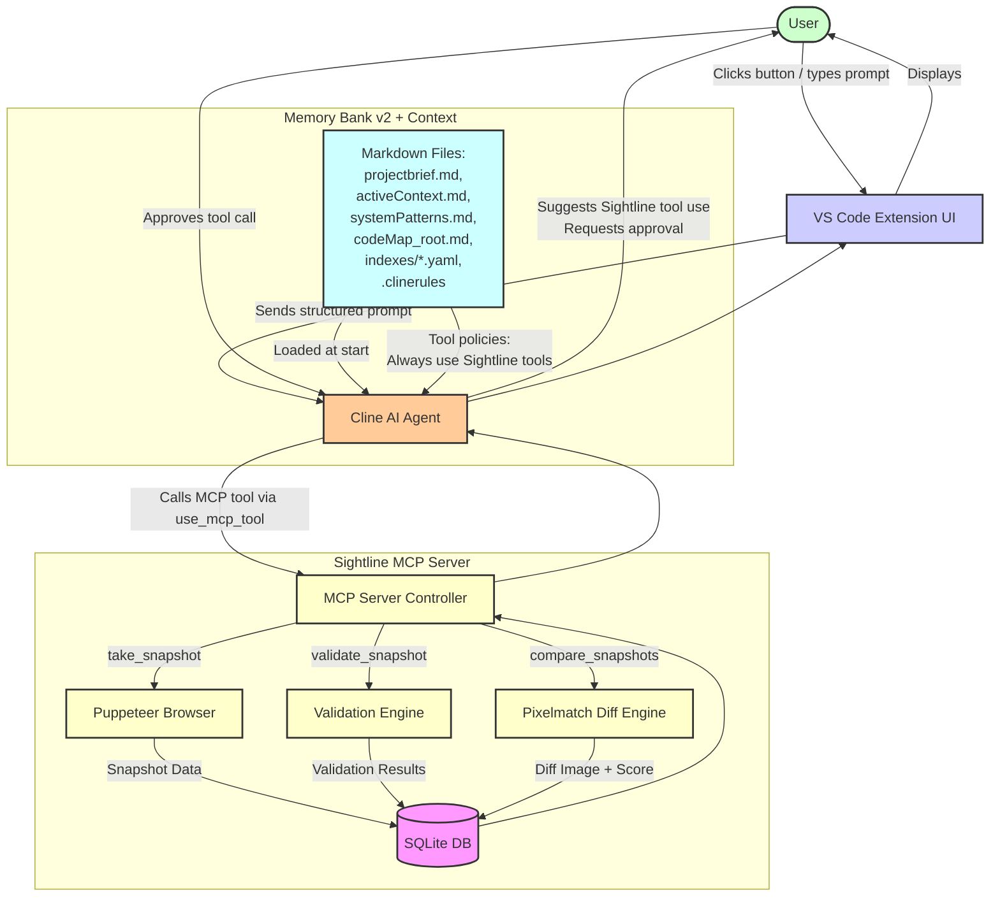

# sightline
-

```mermaid
flowchart TD
    %% User Interaction Layer
    User([User]) -->|Clicks button / types prompt| VSCodeExt[VS Code Extension UI]
    VSCodeExt -->|Sends structured prompt| Cline[Cline AI Agent]
    Cline -->|Suggests Sightline tool use\nRequests approval| User
    User -->|Approves tool call| Cline
    Cline -->|Calls MCP tool via use_mcp_tool| MCPServer

    %% MCP Server Layer
    subgraph MCP_Server["Sightline MCP Server"]
        MCPServer[MCP Server Controller]
        MCPServer -->|take_snapshot| Puppeteer[Puppeteer Browser]
        MCPServer -->|validate_snapshot| Validator[Validation Engine]
        MCPServer -->|compare_snapshots| Pixelmatch[Pixelmatch Diff Engine]
        Puppeteer -->|Snapshot Data| SQLiteDB[(SQLite DB)]
        Validator -->|Validation Results| SQLiteDB
        Pixelmatch -->|Diff Image + Score| SQLiteDB
    end

    %% Data Flow Back
    SQLiteDB --> MCPServer
    MCPServer --> Cline
    Cline --> VSCodeExt
    VSCodeExt -->|Displays| User

    %% Persistent Context Layer
    subgraph MemoryBank["Memory Bank v2 + Context"]
        MBFiles[Markdown Files:\nprojectbrief.md,\nactiveContext.md,\nsystemPatterns.md,\ncodeMap_root.md,\nindexes/*.yaml,\n.clinerules]
        MBFiles -->|Loaded at start| Cline
        MBFiles -->|Tool policies:\nAlways use Sightline tools| Cline
    end

    %% Annotations
    classDef user fill:#cfc,stroke:#333,stroke-width:2px
    classDef ext fill:#ccf,stroke:#333,stroke-width:2px
    classDef cline fill:#fc9,stroke:#333,stroke-width:2px
    classDef mcp fill:#ffc,stroke:#333,stroke-width:2px
    classDef db fill:#f9f,stroke:#333,stroke-width:2px
    classDef mem fill:#cff,stroke:#333,stroke-width:2px
    class User user
    class VSCodeExt ext
    class Cline cline
    class MCPServer mcp
    class Puppeteer,Validator,Pixelmatch mcp
    class SQLiteDB db
    class MBFiles mem
```
